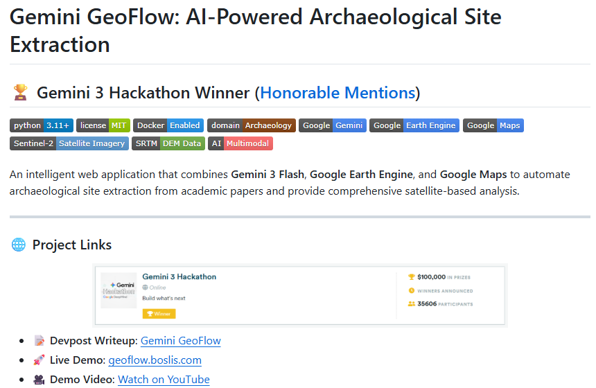

# Accessible AI for Archaeology

<div align="center">


**A User-Friendly Workflow for Predictive Site Detection**


[](LICENSE)
[](https://drive.google.com/file/d/1rJkwbhSlKBI2hIDm661J4iMgsOZtOPDx/view)


*Presented at CAA 2026 (Computer Applications and Quantitative Methods in Archaeology)*  
*Session S45: Computational Archaeology at Scale*

</div>

---

## Overview

This repository provides a comprehensive end-to-end pipeline for archaeological site detection using multi-modal remote sensing data. From data preparation to model deployment, the system addresses key challenges in archaeological remote sensing: sparse site labels, uncertain negative samples, and strong cross-region domain shift.

### Key Features

- **End-to-end workflow**: Complete pipeline from raw data ingestion to trained models
- **Multi-modal fusion**: Combines Sentinel-2 optical imagery with FABDEM/SRTM terrain data
- **Two-stage detection**: Classification for candidate screening + segmentation for spatial localization
- **Smart negative sampling**: Integrated negatives from site surroundings + landcover negatives for robustness
- **Transfer learning**: Few-shot adaptation enables cross-region generalization
- **Open data focus**: Built entirely on open archaeological records and public remote sensing APIs

### Pipeline Architecture

```
┌─────────────────────────────────────────────────────┐
│  Stage 0: Data Preparation                          │
│  Open site records + Google Earth Engine → Training │
├─────────────────────────────────────────────────────┤
│  Stage 1: Classification (Patch Screening)          │
│  CNN classifier → Candidate site detection          │
├─────────────────────────────────────────────────────┤
│  Stage 2: Localization (Spatial Refinement)         │
│  U-Net segmentation → Site boundary prediction      │
└─────────────────────────────────────────────────────┘
```

---

## Project Status

### ✅ Stage 0: Data Preparation

Multi-modal dataset construction from open records and Google Earth Engine.

- **Input**: Archaeological site coordinates + optional KML contours
- **Output**: 11-channel patches (optical + terrain + spectral indices)
- **Formats**: Zarr arrays on Google Cloud Storage for cloud-native access
- **Features**:
  - Positive samples with position offsets and rotation augmentation
  - Integrated negatives from site surroundings
  - Landcover negatives from urban/water/cropland regions
  - Multiple label variants (hard binary + soft Gaussian with σ=1,3,8)

**[→ Go to Data Preparation](00_Data_Preparation/)**

#### Related Project

[](https://github.com/BostonListener/GeminiGeoFlow)

**[GeminiGeoFlow](https://github.com/BostonListener/GeminiGeoFlow)** - A companion tool developed alongside this research that automates archaeological site extraction from academic papers using Gemini 3's multimodal capabilities. The system combines PDF analysis, satellite imagery interpretation, and contextual research to convert unstructured academic text into actionable GIS data, democratizing access to remote sensing analysis for the archaeological community.

---

### 🚧 Stage 1: Classification Model

**Coming soon...**

Binary classification for patch-level site detection with cross-region transfer learning.

---

### 🚧 Stage 2: Segmentation Model

**Coming soon...**

U-Net based spatial localization for site boundary prediction.

---

## Citation

If you use this work in your research, please cite:

```bibtex
@inproceedings{li2026accessible,
  title={Accessible AI for Archaeology: A User-Friendly Workflow for Predictive Site Detection},
  author={Li, Linduo and Wu, Yifan and Wang, Zifeng and Zhuang, Yongjie},
  booktitle={Proceedings of CAA 2026},
  year={2026}
}
```

---

## Contact

- **Linduo Li** - Institut Polytechnique de Paris - [linduo.li@ip-paris.fr](mailto:linduo.li@ip-paris.fr)
- **Yifan Wu** - ARCHMAT Erasmus Mundus - [yi.fan.wu.19@alumni.ucl.ac.uk](mailto:yi.fan.wu.19@alumni.ucl.ac.uk)
- **Zifeng Wang** - Northeastern University (USA) - [wang.zifen@northeastern.edu](mailto:wang.zifen@northeastern.edu)
- **Yongjie Zhuang** - Amazon.com, Inc.* - [yongjie.zg@gmail.com](mailto:yongjie.zg@gmail.com)

*\*This work does not relate to the author's position at Amazon.com, Inc.*

---

## License

This project is licensed under the MIT License - see the [LICENSE](LICENSE) file for details.

---

## Acknowledgments

- Archaeological site data: [James Q. Jacobs Geoglyph Inventory](https://jqjacobs.net/archaeology/geoglyph.html)
- Remote sensing data: Google Earth Engine (Sentinel-2, FABDEM/SRTM)
- Conference: CAA 2026, Vienna, Austria